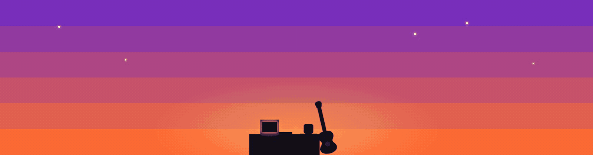

 

  

 

## 🌆 About Me

- 🎓 **3rd Year B.Tech CSE** student, based in Ranchi, Jharkhand, India
- 🤖 Building towards **AI Automations** — agents, bots, and things that run while I sleep
- 🌀 Creative · Deep-Thinker · Passionate
- 🌙 **Night owl** — 100% of my best code gets written after midnight
- ⚡ Coding fuel: **just vibes** — no coffee, no energy drinks, pure focus
- 🛠️ IDE of choice: **VS Code + Claude Code**
- 😄 The dev who makes you laugh *and* debug — serial experimenter, if it exists I've probably tried building it
- 💬 **"One Day At a Time"**

 

## 🛠️ Tech Stack

 

**Languages**
 

**Frontend / Backend / Data**
 

**AI / ML / Automation**
 

**Protocols / Tools**
 

 

## 📊 GitHub Stats

 

### 🐍 Contribution Snake

<picture>
  <source media="(prefers-color-scheme: dark)" srcset="https://raw.githubusercontent.com/iprashantraj/iprashantraj/output/snake-dark.svg" />
  <source media="(prefers-color-scheme: light)" srcset="https://raw.githubusercontent.com/iprashantraj/iprashantraj/output/snake.svg" />
  
</picture>

generated nightly from my contribution graph — appears after the first Action run post-publish

 

## 🎯 Featured Projects

<table>
<tr>
<td width="50%"></td>
<td width="50%"></td>
</tr>
<tr>
<td width="50%"></td>
<td width="50%"></td>
</tr>
<tr>
<td width="50%"></td>
<td width="50%"></td>
</tr>
</table>

 

## 💻 LeetCode Stats

 

## 🎸 Beyond the Code

<table>
<tr>
<td align="center" width="33%">

### 🎸
**Guitar**
 
Bedroom guitarist chasing riffs between builds

</td>
<td align="center" width="33%">

### 🎧
**Rock Music**
 
Rock on repeat while the code compiles

</td>
<td align="center" width="33%">

### 📸
**Photography**
 
Chasing golden hour, one frame at a time

</td>
</tr>
</table>

 

### 💬 "One Day At a Time"

 

